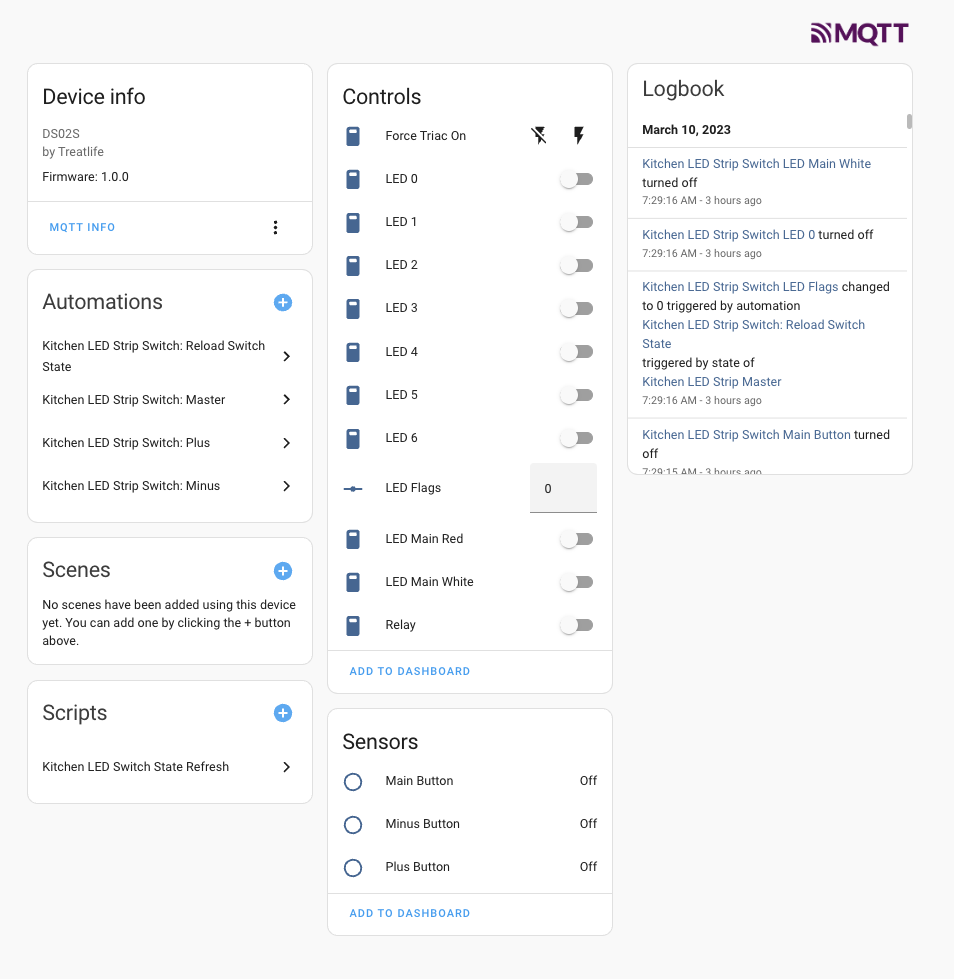

# Open TuyaMCU firmware for Treatlife DS02

This repository is an alternative TuyaMCU firmware for the Treatlife DS02. It implements the same TuyaMCU interface as the original firmware but exposes all the buttons and LEDs directly over the interface, enabling controllers higher up the stack (OpenBeken, Home Assistant, etc.) to directly react to and implement the switches' functionality.

## Background

The Treatlife DS02 is an inexpensive dimmer available on Amazon. It is possible to flash the wireless controller with [OpenBeken](https://github.com/openshwprojects/OpenBK7231T_App), replacing the Tuya based controller with local-based control using MQTT. However, the switch functionality is controlled by a different microcontroller, a Nuvoton M031EC1AE. The BK7231T only can send dimming commands to the microcontroller, so it is not possible to, for example, send a MQTT message when a button is pressed since the Nuvoton microcontroller handles this functionality locally. The most likely reason Treatlife chose to use a separate microcontroller is that the Beken has insufficient I/Os to control the triac, relay and switches. Since I replaced all my lights with smart lights, I wanted to get rid of the dimmer and switch control as much as possible,
set all the lights permanently on, and use the Treatlife as a scene controller.

Fortunately, Treatlife left the programming pins for the Nuvoton exposed, and it is relatively simple to connect a debugger to the Nuvoton using a debug probe and OpenOCD, paving the way to upload alternative firmware. Tuya open-sourced a library that implements the [TuyaMCU interface](https://github.com/tuya/tuya-iotos-embeded-mcu-demo-wifi-ble-samrt-lawn-mower/tree/main/GD32_lawn_mower/User), which should greatly simplify development.

Note that this repository is currently for the board labeled "DS02S_MAINBOARD_V2.1". From the [FCC filings](https://fccid.io/2ANIFDS02S/Internal-Photos/Internal-Photo-4394339) it looks like a different Nuvoton was used in earlier boards back when a TYWE3S ESP8266 was used for the wifi module.

## Hardware

I was able to use OpenOCD and a PicoProbe (Raspberry Pi Pico) to connect to the
Nuvoton over the SWD and SWCLK pins. It appears that the RX/TX pins connect to
UART1 on the Nuvoton, so the BK7231T needs to be directly probed to be
reprogrammed.

With some pin probing and loading a small program on to to the Nuvoton, I was able
to determine the [pin mapping](#pin-mapping).

The DS02 is built so that there are two boards: a power supply and control board
connected to the MCU board with a flat flexible cable (FFC). In addition to power,
the FFC carries signals for dimming. The MCU detects a zero-crossing interrupt
and can turn on a triac for dimming, or switch the load off via a relay. There's
also a temperature sensor of some sort on the control board, but I did not probe further
as I was more interested in using the buttons as a scene controller than 
controlling a load. The buttons and LEDs are mapped to simple I/Os.

## Software

Tuya packages the library so that you implement a few stub functions in `protocol.c` to handle UART sending and receiving, 
and you schedule or call `wifi_uart_service.c` to invoke the library functions. Since the code is fairly simple,
I didn't bother with an RTOS, but decided on a simple interrupt-driven design with a main loop, which merely 
passes most of the IOs as "datapoints" to the BK7231T. 

I added a few special [DPIDs](#dpids) for setting the LEDs atomically as flags, and to override the Triac control.
I didn't bother testing the Triac, but the theory of operation is simple: When the zero-crossing interrupt is triggered,
a timer goes off which fires on the triac after a delay (dpid 40). The triac is only held on momentarily (dpid 41),
because the triac will conduct until current is zero again at the next zero crossing. Note that all of this
is *untested* so use it at your own risk.

## Building

The main requirement is an `arm-none-eabi-` toolchain and a build system. 

On Debian based systems:

```
apt-get install build-essential gcc-arm-none-eabi
make
```

Should build `main.elf` which you can flash to the device.

Alternatively, you can download the [artifact from gh-actions](https://github.com/no2chem/open-tuyamcu/actions/runs/4387763734). Whenever I get semantic versioning working, it'll get put into releases.

## Flashing

You'll need a modified openocd to flash the Nuvoton. Mainline openocd doesn't have code as of this writing to flash the M031.

So either you'll have to use [Nuvoton's openocd](https://github.com/OpenNuvoton/OpenOCD-Nuvoton), which doesn't support the picoprobe, or you can apply the patch in the `openocd_patch` directory, replacing `src/flash/nor/numicro.c`.

**NOTE THAT TRIAC CONTROL IS UNTESTED SO BE WARNED BEFORE HOOKING A REAL LOAD**

You can just program the elf file:

`openocd -f interface/cmsis-dap.cfg -f target/numicro.cfg -c "reset halt program main.elf verify reset exit"`

## OpenBK configuration

I use a simple `autoexec.bat` script in OpenBK, which you can find in the repository.

## Home assistant (HA) configuration

The script `ha-install.ts` can be used to install MQTT discovery entries in HA.

You'll need nodejs, and you'll need to install all the dependencies:

```
npm i
```

Then you can run `ha-install.ts` with the topic of your switch. For example:

```
./ha-install.ts -b mqtt://broker -d openbk/kitchen_ceiling_light_switch -n "Kitchen Ceiling Light Switch" --broker-username admin --broker-password "password"
```

## HA automation

Once you install the device in HA, you can configure the entity.



This lets me configure automations for when the buttons are pressed in one central place, HA. I can check if it's dark outside
to turn on the main LED button as a night light as well. I run a script to "reload" the switch state whenever the target- controlled devices change as well. So far, since everything is local, there has been little to no lag.

## DPIDs

| DPID |    Description |
|------|----------------|
|0 | Main Button|
|1 | Plus Button|
|2 | Minus Button|
|10 | LED0|
|11 | LED1|
|12 | LED2|
|13 | LED3|
|14 | LED4|
|15 | LED5|
|16 | LED6|
|17| Main Red LED|
|18| Main White LED|
|20| LED flags|
|32| Relay|
|40| Triac Delay|
|41| Triac on Time|
|42| Triac force on|
|50 | Temp ADC Raw|


## Pin Mapping
|  Pin | M031EC1AE Port/Pin | Function | Description | DPID |
|----------------|------|----------|-------------|------|
| 1| PA12 | GPIO| LED 0 | 10 |
| 2| PA13 | GPIO| LED 1 | 11 |
| 3| PA14 | UART| TuyaMCU RXD |  |
| 4| PA15 | UART| TuyaMCU TXD |  |  
| 5|  | Vss|  |  |
| 6|  | LDO_CAP|  |  |
| 7|  | Vdd|  |  |
| 8| PB14 | ADC | Temp | 50 |
| 9| PB13 | GPIO | LED 2 | 12 |
| 10| PB12 | GPIO | LED 3 | 13 |
| 11| AVdd |  |  |  |
| 12| PB5 | TMR | Zero-Crossing Interrupt |  |
| 13| PB4 | GPIO | Check 2 |  |
| 14| PB3 | GPIO | Check 1 |  |
| 15| PB2 | GPIO | Main Button | 0 |
| 16| PB1 | GPIO | LED 4 | 14 |
| 17| PB0 | PWM | Dim / Triac |  |
| 18| PF3 | GPIO | LED5 | 15 |
| 19| PF2 | GPIO | Minus Button | 2 |
| 20| PA3 | GPIO | Relay |  32 |
| 21| PA2 | GPIO | Plus Button | 1 |
| 22| PA1 | GPIO | Main Button White LED | 17 |
| 23| PA0 | GPIO | Main Button Red LED | 18 |
| 24| nReset | |  |  |
| 25| PF0 | SWD |  |  |
| 26| PF1 | SWCLK |  |  |
| 27| PC1 | GPIO | LED 6 | 16 |
| 28| PC0 |  |  |  |

## License

This code is released under the MIT license, except the OpenOCD patch which is released under GPL2.

Copyright (C) 2023 by Michael Wei                          
michael@wei.email

Permission is hereby granted, free of charge, to any person obtaining a copy of this software and associated documentation files (the “Software”), to deal in the Software without restriction, including without limitation the rights to use, copy, modify, merge, publish, distribute, sublicense, and/or sell copies of the Software, and to permit persons to whom the Software is furnished to do so, subject to the following conditions:

The above copyright notice and this permission notice shall be included in all copies or substantial portions of the Software.

THE SOFTWARE IS PROVIDED “AS IS”, WITHOUT WARRANTY OF ANY KIND, EXPRESS OR IMPLIED, INCLUDING BUT NOT LIMITED TO THE WARRANTIES OF MERCHANTABILITY, FITNESS FOR A PARTICULAR PURPOSE AND NONINFRINGEMENT. IN NO EVENT SHALL THE AUTHORS OR COPYRIGHT HOLDERS BE LIABLE FOR ANY CLAIM, DAMAGES OR OTHER LIABILITY, WHETHER IN AN ACTION OF CONTRACT, TORT OR OTHERWISE, ARISING FROM, OUT OF OR IN CONNECTION WITH THE SOFTWARE OR THE USE OR OTHER DEALINGS IN THE SOFTWARE.